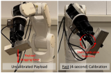
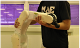
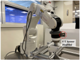

Shilin Shan is a Ph.D. candidate at [Nanyang Technological University](https://www.ntu.edu.sg), specializing in robotic manipulation, dynamics modeling, and physical human-robot interaction with a focus on deep learning. He is supervised by Prof. Quang-Cuong Pham and Prof. Domenico Campolo. 

Shilin earned his Bachelor's degree from Nanyang Technological University (2021) with Highest Distinction.

[Email](mailto:SHILIN001@e.ntu.edu.sg)
[LinkedIn](https://www.linkedin.com/in/shilin-shan-99475a17b/)

News
-----
∙ [2024-09] One paper accepted to RA-L  
∙ [2024-01] One paper accepted to ICRA 2024  
∙ [2023-12] One paper accepted to RA-L  
∙ [2021-08] Start Ph.D. in School of Mechanical and Areospace Engineering in NTU  

Education
-----

### Nanyang Technological University

Aug 2021 - Present 
Ph.D. student at School of Mechanical and Areospace Engineering 

-----

### Nanyang Technological University

Aug 2017 - May 2021  
B.E. in Mechanical Engineering (Mechatronincs and Robotics) 
CGPA: 4.82 / 5.00  

-----

Publications
-----

†: corresponding author  

### Fast Payload Calibration for Sensorless Contact Estimation Using Model Pre-training

<strong>Shilin Shan†</strong>, Quang-Cuong Pham  
IEEE Robotics and Automation Letters (<strong>RA-L</strong>), 2024
<a href="https://arxiv.org/abs/2409.03369">Paper</a> | 
<a href="https://youtu.be/aSl1Ke7fFQI">Video</a>
 

-----

### Sensorless Estimation of Contact Using Deep-Learning for Human-robot Interaction

<strong>Shilin Shan†</strong>, Quang-Cuong Pham  
IEEE International Conference on Robotics and Automation (<strong>ICRA</strong>), 2024
<a href="https://arxiv.org/abs/2309.16219">Paper</a> | 
<a href="https://youtu.be/Yrjf5tU94e8">Video</a>
 

-----

### Fine Robotic Manipulation without Force/Torque Sensor

<strong>Shilin Shan†</strong>, Quang-Cuong Pham  
IEEE Robotics and Automation Letters (<strong>RA-L</strong>), 2023
<a href="https://arxiv.org/pdf/2301.13413">Paper</a> | 
<a href="https://youtu.be/spztx3GzPzc">Video</a>
 

-----

Awards
-----
∙ [2021] NTU Ph.D. Research Scholarship 
∙ [2019] NTU President Research Scholar 
∙ [2018 & 2019] Dean’s List (School of Mechanical and Areospace Engineering) 
∙ [2017] NTU Science and Engineering Undergraduate Scholarship 

Professional Service
-----

Reviewer: RA-L, ICRA  

Teaching
-----
∙ Teaching Assistant: MA2012 Introduction to Mechatronics System Design, NTU, 2024 Spring 
∙ Teaching Assistant: MA2071 Hands-on Augmented Reality / Virtual Reality, NTU, 2023 & 2024 
